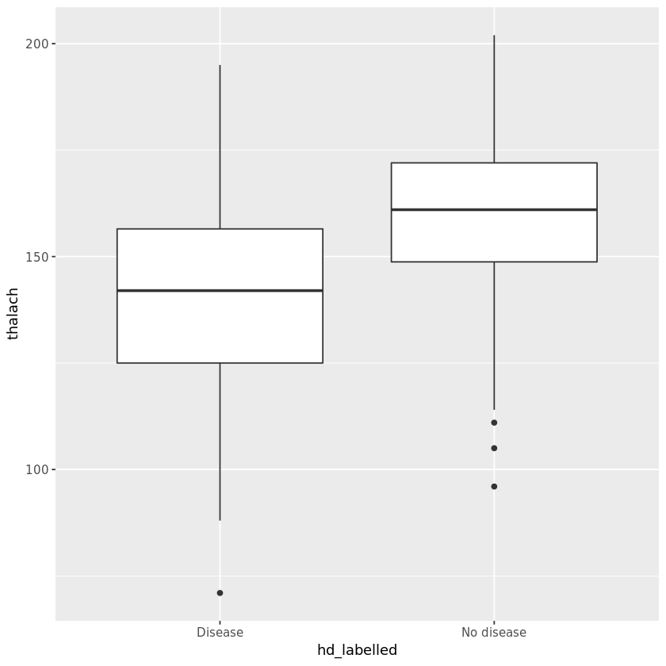

# What-Your-Heart-Rate-Is-Telling-You
Heart disease is the leading cause of death in the United States. Researchers are using several data mining techniques to help health care professionals in the diagnosis of heart disease. In this project, you will examine the relationship between the maximum heart rate one can achieve during exercise and the likelihood of developing heart disease. Using multiple logistic regression, you will handle the confounding effects of age and gender.  This project uses the Cleveland heart disease dataset.

# Goals
- 1. Find out the association and correlation between heart disease and several concerned variables (using chisquare, t-testing and visualizations)
- 2. Build a logistic model to predict the disease

# Pacakges
`library(tidyverse)` 
`library(metrics)` 
`library(broom)` 

# Results

## testing and graphing results
From the testing results above, we could tell that
 
1 Sex and Heart disease are associated

 
2 The older you are, the more chance you will be diagnosed with heart disease

 
3 As for thalach,maximum heart rate one can achieve during exercise, the non-disease group could achieve higher.

## Model performance
 
After these metrics are calculated, we'll see (from the logistic regression OR table) that older age, being male and having a lower max heart rate are all risk factors for heart disease. We can also apply our model to predict the probability of having heart disease. For a 45 years old female who has a max heart rate of 150, our model generated a heart disease probability of 0.177 indicating low risk of heart disease. Although our model has an overall accuracy of 0.71, there are cases that were misclassified as shown in the confusion matrix. One way to improve our current model is to include other relevant predictors from the dataset into our model, but that's a task for another day!
